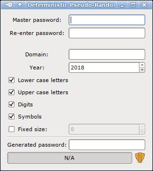

# dprpwg: a Deterministic Pseudo-Random PassWord Generator

`dprpwg` is a Deterministic Pseudo-Random Password Generator.
**It does not store a password database.**
It is intended to be used for website accounts.

Everyone know good practices for passwords on the web:
- Use a combinaison of letters (upper and lower case), digits, and symbols;
- Have a long-enough password;
- Use one password per website;
- Change passwords often;
- <One more another annoying advice that you won't follow>;
- etc...

This tool should help to fulfill at least the fourth first advices listed
above.

## How that works

To generate a password, this tool uses the following inputs:
- One **master password**. The one you always use, for example ;)
- One **domain name**, so you can have one password per website;
- The **year**, to encourage you to change the password every year;
- The **symbol category selection** to use in the generated password
(upper case, lower case letters, digits, symbols)

With these inputs, it generates a **deterministic, pseudo-random password,**
containing (should) at least one symbol from each symbol category.

*Deterministic*, because given the same input combinaison, it generates
the same password.

*Pseudo-random*, because it uses the input like a hash algorithm would do.
**BIG DISCLAIMER, by the way: this is not a sha-2 hash or something!**
This is a probably very bad, home-designed hash algorithm. I am not sure
it would hold long against a cryptographic analysis.
But hey, I'm no cryptanalist either.

The main feature here: **it does not generate/store any password database!**
To retrieve the password you registered with on any website, just input
the website, the year and your master password, and you get it.

Hopefully, the base password should be very hard to find, given the generated
password. So, if your account is hacked in some website (and if this tool
is not so commonly used...), the disater should be contained.

## Building

### Generate `dprpwg_config.h`

Here is the drawback of this tool: you will need to generate your own
`dprpwg_config.h` file under `src/dprpwg_config.h`.
Go check [`dprpwg_config.stub.h`](src/dprpwg_config.stub.h) for the syntax.

So, write some numbers there, and keep it secret.
Maybe. I don't know if it is important, actually...
But I will not commit my *own* version of this file, so you will have
to generate it.

### Now, proper building

A [`Makefile`](Makefile) is included to help buidling the tool. Only the
`Makefile` is documented here. If you want to build the tool another way,
help yourself ;)

#### Build requirements

For everything that use the Makefile:
- make
- gcc

For the GTK+2 version:
- pkg-config
- GTK+ 2.24. Maybe a lower version works, but I will not test that.

For the GTK+3 version *(experimental)*:
- pkg-config
- GTK+ 3. I don't know which version works.

#### GTK+2 client

By default, calling `make` will build the GTK+2 client under `bin/dprpwg-gtk`.

#### GTK+3 client

To generate the GTK+3 version, invoke `make GTKVERSION=3`.

*Note this is highly experimental*.
You'll get a lot of "deprecated"-style warnings at build time,
but it builds and runs.

## Using

#### GTK+2/GTK+3 client

Run `dprpwg-gtk`, and if things are correct, you should get something like that:

Enter your master password *twice*, a domain name, check the year is
correct, and there you go:

Now use the generated password at your convenience.

Note that the GTK client needs you to enter your master password twice.
That's because if you use a generated password to register on a website,
and you made a typo in the master password, you would not be able to
retrieve your password ever again... So, doublecheck.

You can configure how to generate the password: upper case letters, lower
case letters, digits or symbols. You can also set the size if needed.
Handy for *that* website which only takes a password of 8 digits
(yes, I do have examples in mind...)

## License

This tool is licensed under the MIT License.
See the [COPYING](COPYING) file for details
